# Phoenix Phantoms 

_Double, double toil and trouble; Phoenix burn, and cauldron bubble!_

A spoooooooky boilerplate project for your Halloween-themed Phoenix app. Made by Elixir Oasis for our Halloween 2023 Code Jam. Happy Haunting!

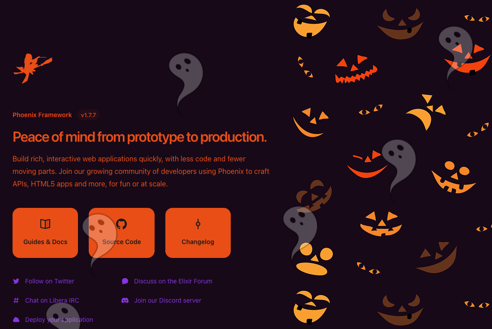

## Installation

Clone this repository, then to start your Phoenix server:

  * Run `mix setup` to install and setup dependencies
  * Start Phoenix endpoint with `mix phx.server` or inside IEx with `iex -S mix phx.server`

Now you can visit [`localhost:4000`](http://localhost:4000) from your browser.

Ready to run in production? Please [check our deployment guides](https://hexdocs.pm/phoenix/deployment.html).

## Fonts

This repo comes bundled with 13 frightening fonts that can be used to make your text super scary. Like super duper scary.

### Coraline's Cat
```html
<span class="font-['CoralinesCat']">Coraline's Cat</span>
```

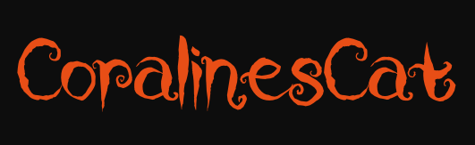

### Ghastly Panic
```html
<span class="font-['GhastlyPanic']">Ghastly Panic</span>
```

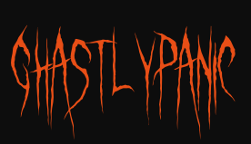

### Horrorcore
```html
<span class="font-['Horrorcore']">Horrorcore</span>
```

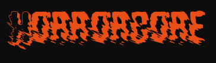

### It Lives In The Swamp
```html
<span class="font-['ItLivesInTheSwamp']">It Lives In The Swamp</span>
```

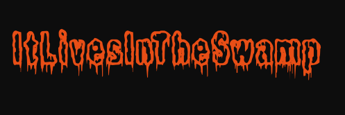

### Lycanthrope
```html
<span class="font-['Lycanthrope']">Lycanthrope</span>
```

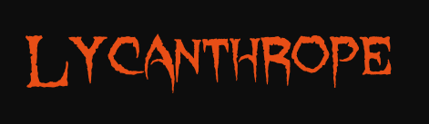

### Raven Song
```html
<span class="font-['RavenSong']">Raven Song</span>
```

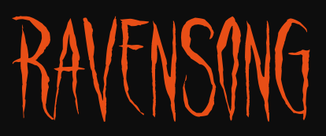

### Spiderfingers
```html
<span class="font-['Spiderfingers']">Spiderfingers</span>
```

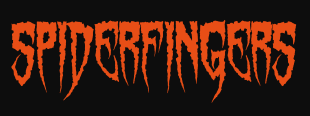

### Swamp Witch
```html
<span class="font-['SwampWitch']">Swamp Witch</span>
```

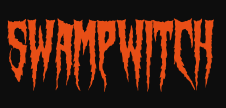

### Vampyrish ABC
```html
<span class="font-['VampyrishABC']">Vampyrish ABC</span>
```

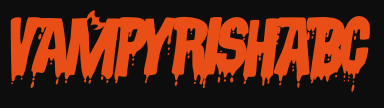

### Vintage Halloween
```html
<span class="font-['VintageHalloween']">Vintage Halloween</span>
```

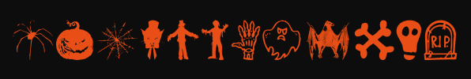

### Witch
```html
<span class="font-['Witch']">Witch</span>
```


### Zombie
```html
<span class="font-['Zombie']">Zombie</span>
```


### Zombified
```html
<span class="font-['Zombified']">Zombified</span>
```

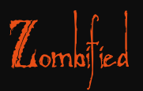

## Sound FX

This Phoenix app has been haunted by a bunch of noisy ghosts! Use the `<.sfx />` component to make your elements play a sound effect when clicked.

```heex
<.sfx id="sound" sample="sfx/wolf.mp3">
  <span class="text-green-500 text-8xl">Click me if you dare!</span>
</.sfx>
```

The following `sample`s are included out of the box:

- [`sfx/crow.wav`](./priv/static/sfx/crow.wav)
- [`sfx/scream.wav`](./priv/static/sfx/scream.wav)
- [`sfx/thunder.wav`](./priv/static/sfx/thunder.wav)
- [`sfx/witch.wav`](./priv/static/sfx/witch.wav)
- [`sfx/wolf.mp3`](./priv/static/sfx/wolf.mp3)
- [`sfx/zombie.wav`](./priv/static/sfx/zombie.wav)

Add custom sounds by copying them into the `priv/static/sfx` directory of this repo.

## Learn more

  * Official Phoenix website: https://www.phoenixframework.org/
  * Guides: https://hexdocs.pm/phoenix/overview.html
  * Docs: https://hexdocs.pm/phoenix
  * Forum: https://elixirforum.com/c/phoenix-forum
  * Source: https://github.com/phoenixframework/phoenix
